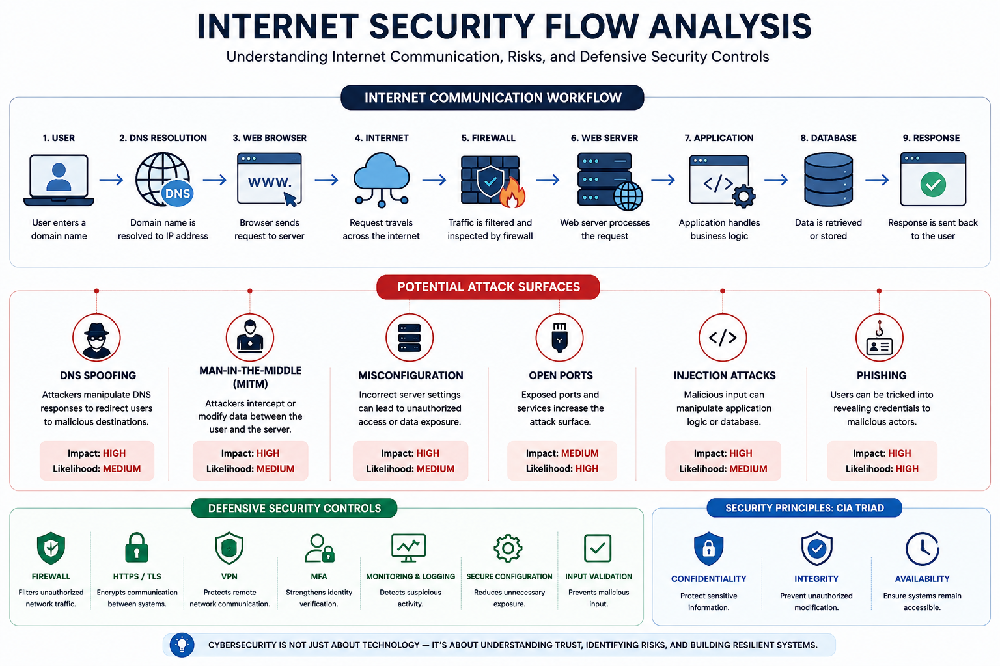

# 🌐 Internet Security Flow Analysis
> **Project Goal:** Understand how internet communication works, identify common attack surfaces, and explore the defensive security controls that protect modern systems.
## ✅ Project Status

Status: Completed

Version: 2.0

Last Updated: July 2026

>A foundational cybersecurity project that analyzes internet communication, identifies attack surfaces, and demonstrates defensive security concepts through a real-world systems perspective.

---

## 🖼️ Project Architecture

<p align="center">
  
</p>

<p align="center">
  <em>Figure 1. High-level internet communication workflow highlighting trust relationships, attack surfaces, and defensive security controls.</em>
</p>
---

## 📑 Table of Contents

- [Overview](#-overview)
- [Project Objectives](#-project-objectives)
- [Internet Communication Workflow](#-internet-communication-workflow)
- [Security Risks](#-security-risks-across-the-workflow)
- [Defensive Security Controls](#️-defensive-security-controls)
- [Security Principles](#-security-principles)
- [Real-World Scenario](#-real-world-scenario)
- [Skills Demonstrated](#-skills-demonstrated)
- [Technologies & Concepts](#️-technologies--concepts)
- [Future Improvements](#-future-improvements)
- [Learning Outcomes](#-learning-outcomes)

## 📖 Overview

Effective cybersecurity begins with understanding how modern systems communicate, where trust exists, and how that trust can be exploited or protected.

This project examines the journey of an internet request—from the moment a user enters a website address until the server returns a response—and identifies the security risks and defensive controls involved at each stage.

Rather than treating networking and cybersecurity as separate subjects, this project connects them through a practical, real-world workflow.

---

## 🎯 Project Objectives

- Understand the lifecycle of internet communication
- Identify common attack surfaces
- Explore defensive security controls
- Apply foundational cybersecurity concepts
- Develop analytical thinking from both attacker and defender perspectives

---

## 🌍 Internet Communication Workflow

```text
User
 │
 ▼
DNS Resolution
 │
 ▼
Web Browser
 │
 ▼
Internet
 │
 ▼
Firewall
 │
 ▼
Web Server
 │
 ▼
Application
 │
 ▼
Database
 │
 ▼
Response

Each stage introduces a different trust relationship and therefore a different security risk.
```

---

## ⚠️ Security Risks Across the Workflow

| Stage | Potential Risk | Security Impact | Impact | Likelihood |
|--------|----------------|-----------------|:------:|:----------:|
| DNS | DNS Spoofing | Redirects users to malicious destinations | High | Medium |
| Network | Man-in-the-Middle (MITM) | Intercepts or modifies data in transit | High | Medium |
| Web Server | Misconfiguration | Unauthorized access | High | Medium |
| Services | Open Ports | Increased attack surface | Medium | High |
| Application | Injection Attacks | Manipulation of application logic | High | Medium |
| User | Phishing | Credential theft and account compromise | High | High |

---

## 🛡️ Defensive Security Controls

| Control | Purpose |
|----------|---------|
| Firewall | Filters unauthorized network traffic |
| HTTPS / TLS | Encrypts communication between systems |
| VPN | Protects remote network communication |
| Multi-Factor Authentication (MFA) | Strengthens identity verification |
| Monitoring & Logging | Detects suspicious activity |
| Secure Configuration | Reduces unnecessary exposure |
| Input Validation | Prevents malicious input |

---

## 🔐 Security Principles

This project demonstrates the practical importance of the **CIA Triad**, the foundation of information security.

| Principle | Objective |
|-----------|-----------|
| Confidentiality | Protect sensitive information |
| Integrity | Prevent unauthorized modification |
| Availability | Ensure systems remain accessible |

---

## 🌍 Real-World Scenario

### Phishing Through DNS Manipulation

A user attempts to access an online banking website using the correct domain name.

An attacker manipulates DNS resolution, redirecting the user to a fraudulent website that appears identical to the legitimate one. Believing the website is genuine, the user enters their login credentials, which are then captured by the attacker.

### What Failed?

- DNS trust was compromised
- The destination could not be verified
- The user unknowingly trusted a malicious website

### Mitigation

- Secure DNS implementation
- HTTPS certificate verification
- Multi-Factor Authentication (MFA)
- User security awareness

---

## 📚 Skills Demonstrated

- Networking
- Threat Analysis
- Risk Assessment
- Security Fundamentals
- Technical Documentation
- Analytical Thinking
- System Thinking
- Problem Solving

---

## 🛠️ Technologies

- TCP/IP
- DNS
- HTTP
- HTTPS
- TLS
- Git
- GitHub
- Markdown

## 🔒 Security Concepts

- Firewall
- VPN
- CIA Triad
- Threat Analysis
- Risk Assessment

---


## 📂 Project Resources

- 📄 [Detailed Technical Report (PDF)](./Internet-Security-Flow-Analysis.pdf)
- 📘 Technical Documentation (README)
---

## 🚀 Future Development

This project will continue to evolve as I expand my cybersecurity knowledge and gain hands-on experience through practical labs and real-world projects.

Future updates may include additional analysis, diagrams, security concepts, and technical improvements based on my learning journey.
---

## 🎓 Learning Outcomes

Through completing this project, I strengthened my ability to:

- Internet communication from a cybersecurity perspective
- Common attack surfaces across modern systems
- Defensive security controls and their practical applications
- Foundational cybersecurity principles
- System thinking and trust relationships within network communication

## 📚 References

- Microsoft Learn
- TryHackMe
- OWASP Foundation
- NIST Cybersecurity Framework
- Cloudflare Learning Center
---

## 👨‍💻 About the Author

**MD Siam Babon**

Aspiring Cybersecurity Analyst with a strong interest in **Security Operations (SOC)**, **Microsoft Azure**, and **Cloud Security**.

Currently developing practical cybersecurity skills through hands-on labs, technical documentation, and security-focused projects while building a professional cybersecurity portfolio aligned with Security Operations (SOC), Microsoft Azure, and Cloud Security.

### 🌱 Hands-on Learning

- TryHackMe
- Microsoft Learn

📧 **Email:** siambabon.it@gmail.com

🔗 LinkedIn: https://www.linkedin.com/in/siambabon

---

## ⚠️ Disclaimer

This project is intended for educational purposes and demonstrates foundational cybersecurity concepts. It does not include offensive exploitation techniques or instructions for unauthorized access.
